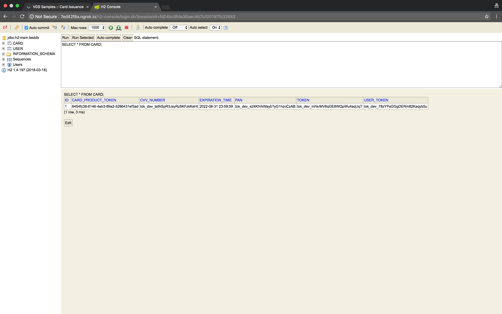

<p align="center"><a href="https://www.verygoodsecurity.com/"></a></p>
<p align="center"><b>VGS Samples – Card Issuance</b></p>

## Introduction

This sample is intended to demonstrate how a payment card issuance application
can be implemented using VGS to secure sensitive data in transit and at rest.

## Requirements

- Make sure [jq](https://stedolan.github.io/jq/) is installed on your system.

## Running the application

### Sign up for a Marqeta account

[Marqeta](https://www.marqeta.com/platform) is a card issuing and payment
processing platform. It provides its customers with a shared API sandbox in
order to acquaint them with the Marqeta API.

We'll be using the API sandbox to simulate virtual card issuance. To get access
to it, sign up for a Marqeta account at https://www.marqeta.com/users/sign_up.

### Marqeta API keys

Once you're signed in to Marqeta, search your profile for API keys and set the
following environment variables with the corresponding values:

```bash
export MARQETA_APPLICATION_TOKEN="<Application Token>"
export MARQETA_MASTER_ACCESS_TOKEN="<Master Access Token>"
```

If you're having difficulties finding your API keys, please refer to
[this paragraph](https://www.marqeta.com/api/guides/WIlA2isAAMkAsk6F/quick-start---marqeta-api#step_____get_access)
of the Marqeta Quick Start guide.


### Create a card product

To issue a card, Marqeta requires a [card product](https://www.marqeta.com/api/docs/VhyptRwAAB8A_VeO/card-products).
Basically, it's a template that specifies various card properties.

Since our application will be issuing virtual cards, we need an appropriate card
product. Create one by executing the following command:

```bash
export MARQETA_CARD_PRODUCT_TOKEN=\
$(curl -X POST \
    https://shared-sandbox-api.marqeta.com/v3/cardproducts \
    --user "$MARQETA_APPLICATION_TOKEN:$MARQETA_MASTER_ACCESS_TOKEN" \
    -H 'Content-Type: application/json' \
    --data '{
        "name": "VGS Samples :: Card Issuance",
        "start_date": "2018-08-06T10:30:00Z",
        "config": {
            "fulfillment": {
                "payment_instrument": "VIRTUAL_PAN"
            },
            "card_life_cycle": {
                "activate_upon_issue": "true"
            }
        }
    }' -s | jq -r '.token')
```

Apart from creating the required resource, it will also set the
`MARQETA_CARD_PRODUCT_TOKEN` environment variable with the unique token
generated by Marqeta for the card product.

### ngrok tunnel

Next, fire up [ngrok](https://ngrok.com/) to expose the local port the
application will be listening on to the Internet:

```bash
./ngrok http 8080
```

This step is done in advance prior to running the application since the
forwarding URL from the ngrok output is used for routes configuration on the VGS
dashboard.


### Create a secure vault

In VGS, sensitive data is stored and managed inside so-called vaults.

Go to the VGS dashboard at https://dashboard.verygoodsecurity.com/ in order to
create a new vault for use with the application. Please refer to our
[Getting Started](https://www.verygoodsecurity.com/docs/getting-started) guide
if you're unfamiliar with the process.

### Configure the VGS proxies

After creating a vault, proceed to the Routes section of it and configure the
routes as described below.


#### Inbound Route

Upstream Host: the forwarding URL previously assigned by ngrok (e.g.,
`https://6ca7be3b.ngrok.io`)

<table>
    <caption>Filters</caption>
    <thead>
        <th>HTTP Method</th>
        <th>PathInfo</th>
        <th>Phase</th>
        <th>Operation</th>
        <th>Fields (Json)</th>
    </thead>
    <tbody>
        <tr>
            <td>POST</td>
            <td>/cards</td>
            <td>On request</td>
            <td>REDACT</td>
            <td>
                <ul>
                    <li>$.first_name</li>
                    <li>$.last_name</li>
                    <li>$.email</li>
                    <li>$.ssn</li>
                </ul>
            </td>
        </tr>
        <tr>
            <td>POST</td>
            <td>/cards</td>
            <td>On response</td>
            <td>REVEAL</td>
            <td>
                <ul>
                    <li>$.token</li>
                    <li>$.user_token</li>
                    <li>$.pan</li>
                    <li>$.cvv_number</li>
                </ul>
            </td>
        </tr>
    </tbody>
</table>

#### Outbound Route

Upstream Host: `shared-sandbox-api\.marqeta\.com`

**NOTE:** Unlike Upstream Host in Inbound Route configuration, this one is
expected to be a [regular expression](https://docs.oracle.com/javase/8/docs/api/java/util/regex/Pattern.html)
(hence the `\` characters).

<table>
    <caption>Filters</caption>
    <thead>
        <th>HTTP Method</th>
        <th>PathInfo</th>
        <th>Phase</th>
        <th>Operation</th>
        <th>Fields (Json)</th>
    </thead>
    <tbody>
        <tr>
            <td>POST</td>
            <td>/v3/users</td>
            <td>On request</td>
            <td>REVEAL</td>
            <td>
                <ul>
                    <li>$.token</li>
                    <li>$.first_name</li>
                    <li>$.last_name</li>
                    <li>$.email</li>
                    <li>$.ssn</li>
                </ul>
            </td>
        </tr>
        <tr>
            <td>POST</td>
            <td>/v3/users</td>
            <td>On response</td>
            <td>REDACT</td>
            <td>
                <ul>
                    <li>$.token</li>
                    <li>$.first_name</li>
                    <li>$.last_name</li>
                    <li>$.email</li>
                    <li>$.ssn</li>
                    <li>$.deposit_account.token</li>
                    <li>$.deposit_account.account_number</li>
                    <li>$.deposit_account.routing_number</li>
                </ul>
            </td>
        </tr>
        <tr>
            <td>POST</td>
            <td>/v3/cards</td>
            <td>On request</td>
            <td>REVEAL</td>
            <td>
                <ul>
                    <li>$.user_token</li>
                </ul>
            </td>
        </tr>
        <tr>
            <td>POST</td>
            <td>/v3/cards</td>
            <td>On response</td>
            <td>REDACT</td>
            <td>
                <ul>
                    <li>$.token</li>
                    <li>$.user_token</li>
                    <li>$.pan</li>
                    <li>$.cvv_number</li>
                </ul>
            </td>
        </tr>
    </tbody>
</table>

### Set route URLs

Lastly, for the routes configured in the previous step to take effect, requests
to and from the application must pass through the VGS reverse and forward
proxies, respectively.

On the vault page, look for the Vault URLs link: 

To set the Inbound Route URL, execute the following command:

```bash
sed -i '' 's|INBOUND_ROUTE_URL|<Inbound Route URL>|g' src/main/resources/static/scripts/index.js
```

It will replace the `INBOUND_ROUTE_URL` placeholder in
[index.js](src/main/resources/static/scripts/index.js) with an actual URL, so
incoming requests are proxied through VGS.

To set the Outbound Route URL, execute the following command:

```bash
export VGS_PROXY_URL="<Outbound Route URL>"
```

The application is aware of this environment variable and will pick its value
automatically to proxy outgoing requests through VGS.

### Start the application

With everything in place, you may now start the application:

```bash
mvn clean package spring-boot:run -DskipTests
```

## Applying for a card

Point your browser to the forwarding URL previously assigned by ngrok (e.g.,
`https://6ca7be3b.ngrok.io`). You will be greeted with a user form.

To apply for a virtual payment card, fill in the form and press the Submit
button.

**NOTE:** Please keep in mind that the Marqeta API sandbox used by this
application is a shared environment. We **_strongly discourage_** you from
providing any personal data that you don't want others to see.


After a short delay, the card details will appear: 

## Verifying data security

At this point, we have already seen the application in action. Now let's ensure
the user data is actually safe.

The application utilizes
[H2 Database Engine](http://www.h2database.com/html/main.html) for persistence.
Open its console at `<ngrok Forwarding URL>/h2-console` (e.g.,
`https://6ca7be3b.ngrok.io/h2-console`) and log in. The default username is
`root` with no password.


To verify user data is secure, execute the following SQL query:

```sql
SELECT * FROM USER;
```


To verify card data is secure, execute the following SQL query:

```sql
SELECT * FROM CARD;
```



As you can see, everything is
[tokenized](https://en.wikipedia.org/wiki/Tokenization_(data_security)).

Moreover, there's no sensitive data in the application log either:

```
2018-08-10 13:57:48.284 DEBUG 71295 --- [nio-8080-exec-2] o.s.web.servlet.DispatcherServlet        : DispatcherServlet with name 'dispatcherServlet' processing POST request for [/cards]
2018-08-10 13:57:48.284 DEBUG 71295 --- [nio-8080-exec-2] s.w.s.m.m.a.RequestMappingHandlerMapping : Looking up handler method for path /cards
2018-08-10 13:57:48.284 DEBUG 71295 --- [nio-8080-exec-2] s.w.s.m.m.a.RequestMappingHandlerMapping : Returning handler method [public com.verygoodsecurity.samples.web.model.CreateCardResponse com.verygoodsecurity.samples.web.controller.CardController.createCard(com.verygoodsecurity.samples.web.model.UserForm)]
2018-08-10 13:57:48.533 DEBUG 71295 --- [nio-8080-exec-2] m.m.a.RequestResponseBodyMethodProcessor : Read [class com.verygoodsecurity.samples.web.model.UserForm] as "application/json;charset=UTF-8" with [org.springframework.http.converter.json.MappingJackson2HttpMessageConverter@7e3beb3]
2018-08-10 13:57:48.570  INFO 71295 --- [nio-8080-exec-2] o.h.h.i.QueryTranslatorFactoryInitiator  : HHH000397: Using ASTQueryTranslatorFactory
2018-08-10 13:57:48.663 DEBUG 71295 --- [nio-8080-exec-2] o.s.web.client.RestTemplate              : Created POST request for "https://shared-sandbox-api.marqeta.com/v3/users"
2018-08-10 13:57:48.674 DEBUG 71295 --- [nio-8080-exec-2] o.s.web.client.RestTemplate              : Setting request Accept header to [application/json, application/json, application/*+json, application/*+json]
2018-08-10 13:57:48.684 DEBUG 71295 --- [nio-8080-exec-2] o.s.web.client.RestTemplate              : Writing [CreateUserRequest[token=tok_dev_78zYPxGGgDERm82Kaqyb5u,firstName=tok_dev_32B7zPuuZctuT5eRDwchdE,lastName=tok_dev_66dwSuCuLyfqvfuedogWER,email=tok_dev_78zYPxGGgDERm82Kaqyb5u,birthDate=1984-07-21,ssn=tok_dev_814ooVk5pNmxdQBeBaQy1z]] using [org.springframework.http.converter.json.MappingJackson2HttpMessageConverter@7e3beb3]
2018-08-10 13:57:52.280 DEBUG 71295 --- [nio-8080-exec-2] o.s.web.client.RestTemplate              : POST request for "https://shared-sandbox-api.marqeta.com/v3/users" resulted in 201 (Created)
2018-08-10 13:57:52.281 DEBUG 71295 --- [nio-8080-exec-2] o.s.web.client.RestTemplate              : Reading [class com.verygoodsecurity.samples.component.marqeta.model.user.CreateUserResponse] as "application/json" using [org.springframework.http.converter.json.MappingJackson2HttpMessageConverter@7e3beb3]
2018-08-10 13:57:52.326 DEBUG 71295 --- [nio-8080-exec-2] o.s.web.client.RestTemplate              : Created POST request for "https://shared-sandbox-api.marqeta.com/v3/cards?show_pan=true&show_cvv_number=true"
2018-08-10 13:57:52.327 DEBUG 71295 --- [nio-8080-exec-2] o.s.web.client.RestTemplate              : Setting request Accept header to [application/json, application/json, application/*+json, application/*+json]
2018-08-10 13:57:52.328 DEBUG 71295 --- [nio-8080-exec-2] o.s.web.client.RestTemplate              : Writing [CreateCardRequest[cardProductToken=6454fc38-6146-4eb3-89a2-5286431ef3ad,userToken=tok_dev_78zYPxGGgDERm82Kaqyb5u]] using [org.springframework.http.converter.json.MappingJackson2HttpMessageConverter@7e3beb3]
2018-08-10 13:57:53.503 DEBUG 71295 --- [nio-8080-exec-2] o.s.web.client.RestTemplate              : POST request for "https://shared-sandbox-api.marqeta.com/v3/cards?show_pan=true&show_cvv_number=true" resulted in 201 (Created)
2018-08-10 13:57:53.503 DEBUG 71295 --- [nio-8080-exec-2] o.s.web.client.RestTemplate              : Reading [class com.verygoodsecurity.samples.component.marqeta.model.card.CreateCardResponse] as "application/json" using [org.springframework.http.converter.json.MappingJackson2HttpMessageConverter@7e3beb3]
2018-08-10 13:57:53.523 DEBUG 71295 --- [nio-8080-exec-2] m.m.a.RequestResponseBodyMethodProcessor : Written [CreateCardResponse[token=tok_dev_mhkrMV6qGE8WQpWu4aqUqT,cardProductToken=6454fc38-6146-4eb3-89a2-5286431ef3ad,userToken=tok_dev_78zYPxGGgDERm82Kaqyb5u,pan=tok_dev_s24KtVkWaybTyG1hzcCzAB,cvvNumber=tok_dev_tafASpR3JsyRz5KFzkKeHt,expirationTime=2022-08-31T23:59:59]] as "application/json" using [org.springframework.http.converter.json.MappingJackson2HttpMessageConverter@7e3beb3]
2018-08-10 13:57:53.524 DEBUG 71295 --- [nio-8080-exec-2] o.s.web.servlet.DispatcherServlet        : Null ModelAndView returned to DispatcherServlet with name 'dispatcherServlet': assuming HandlerAdapter completed request handling
2018-08-10 13:57:53.524 DEBUG 71295 --- [nio-8080-exec-2] o.s.web.servlet.DispatcherServlet        : Successfully completed request
```
